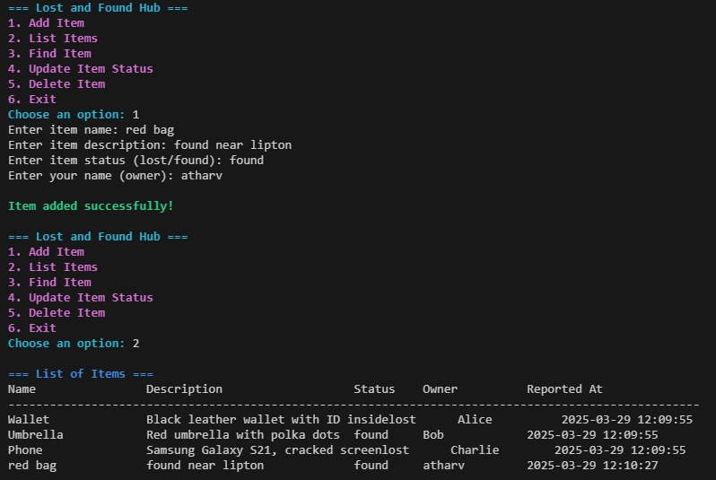
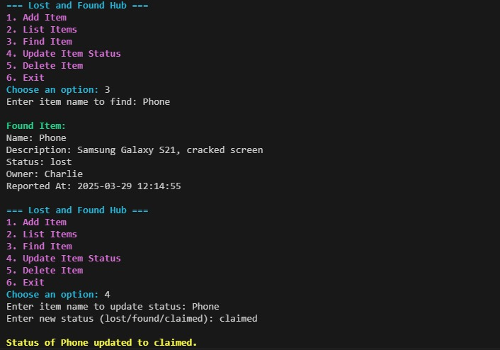
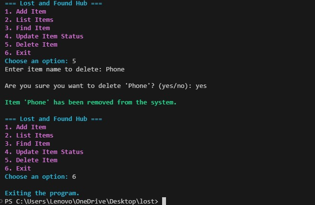

# Lost-and-Found-Hub

## 📌 Project Description
Lost and Found Hub is a simple *Command-Line Interface (CLI) application* that helps users report lost and found items. It allows users to add, list, search, update, and delete items while keeping track of timestamps. This project demonstrates Object-Oriented Programming (OOP) concepts in C++ and provides an interactive user experience.

## 🚀 Features
- *Add Items*: Users can report lost or found items with details.
- *List Items*: Displays all reported items in a formatted manner.
- *Search Items*: Allows users to search for an item by name.
- *Update Status*: Users can update an item's status (e.g., from lost to found).
- *Delete Items*: Users can remove an item after it has been claimed.
- *Timestamps*: Each item includes a timestamp of when it was reported.
- *Colorful CLI Output*: Enhances readability using ANSI escape codes.

## 🛠 Technologies Used
- *C++* (Object-Oriented Programming)
- *Standard Template Library (STL)* (Vector, String)
- *ANSI Escape Codes* (For CLI Styling)

## 📌 How to Run the Project
### 1️⃣ Compile the Program
sh
 g++ lost_found.cpp -o lost_found

### 2️⃣ Run the Program
sh
 ./lost_found

## 📖 Usage Instructions
1. Run the program and choose an option from the menu.
2. Follow the prompts to add, search, update, or delete items.
3. View the list of lost and found items at any time.
4. Exit the program when done.

## 📸 Example Output

## 🏗 Future Improvements
- Add a *database or file storage* for persistent data.
- Implement a *GUI version* for better accessibility.
- Improve search functionality with *filters*.

---
*Developed by:* [Atharv Kulakrni]
